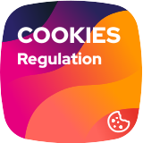

# Table of content

1. [Installation](#1-installation)
2. [Usage](#2-usage)
    - [Init](#init)
    - [Open Modal](#open-modal)
3. [Versioning](#3-versioning)
4. [Contributing](#4-contributing)
5. [Hacking](#5-hacking)
6. [License](#6-license)

# 1. Installation

You can install the library with [npm](https://www.npmjs.com/get-npm) or with [yarn](https://yarnpkg.com/getting-started/install):

```bash
# NPM
npm install @rich-id/cookies-regulation

# Yarn
yarn add @rich-id/cookies-regulation
```

Add the library to your js

```js
import CookiesRegulation from '@rich-id/cookies-regulation';

OR

window.CookiesRegulation = require('@rich-id/cookies-regulation');
```


# 2. Usage

### Init

```html
<script>
    CookiesRegulation.init(
        {
            website: 'Cookies Regulation', /* Name of your site (1) */
            privacyPolicy: {
                url: 'https://example.com/privacy', /* Privacy policy url (2) */
                label: 'Privacy Policy', /* Privacy policy link label (2) */
                openInNewWindow: true, /* Does the link open in a new window (2) */
            },
            modal: {
                header: 'Lorem ipsum dolor sit amet, consectetur adipiscing elit. Cras hendrerit, velit vitae accumsan pellentesque, sapien arcu gravida nibh, at accumsan nulla sapien sed magna. Integer sed sem dolor. Pellentesque feugiat, quam quis dapibus vehicula, risus morbi.', /* The text Display in the header of the modal (3) */
                relatedCompaniesCount: 5, /* Number of third party companies (4) */
                relatedCompaniesPrivacyPolicyUrl: '' /* Link of third party companies (4) */
            },
            services: {
                googleTagManager: { /* Auto-configured service */
                    name:         'Google Tag Manager', /* Service name (5) */
                    description:  'Tag management system', /* Service description (6) */
                    conservation: '6 months.', /* Cookies conservation (7) */
                    service: 'googleTagManager',
                    options: {id: 'GTM-TEST'},
                },
                cookieTest1: { /* Manual service configuration */
                    name:         'Test Cookie', /* Service name (5) */
                    description:  'Test description.', /* Service description (6) */
                    conservation: '1 year.', /* Cookies conservation (7) */
                    mandatory:    true, /* Does the service require user consent */
                    initializationCallback: function () {
                    }
                },
                cookieTest2: {
                    name:         'Other test cookie',
                    description:  null,
                    conservation: '6 months.',
                    mandatory:    false,
                },
                cookieTest3: {
                    name:         'Other test cookie 2',
                    description:  null,
                    conservation: 'until you log out.',
                    mandatory:    false,
                }
            },
            locale: 'en', /* Local: en|fr */
        }
    );
</script>
```


### Open Modal

```js
window.CookiesRegulation.openModal();
```
# 3. Versioning

tour-bundle follows [semantic versioning](https://semver.org/). In short the scheme is MAJOR.MINOR.PATCH where
1. MAJOR is bumped when there is a breaking change,
2. MINOR is bumped when a new feature is added in a backward-compatible way,
3. PATCH is bumped when a bug is fixed in a backward-compatible way.

Versions bellow 1.0.0 are considered experimental and breaking changes may occur at any time.


# 4. Contributing

Contributions are welcomed! There are many ways to contribute, and we appreciate all of them. Here are some of the major ones:

* [Bug Reports](https://github.com/rich-id/cookies-regulation/issues): While we strive for quality software, bugs can happen, and we can't fix issues we're not aware of. So please report even if you're not sure about it or just want to ask a question. If anything the issue might indicate that the documentation can still be improved!
* [Feature Request](https://github.com/rich-id/cookies-regulation/issues): You have a use case not covered by the current api? Want to suggest a change or add something? We'd be glad to read about it and start a discussion to try to find the best possible solution.
* [Pull Request](https://github.com/rich-id/cookies-regulation/merge_requests): Want to contribute code or documentation? We'd love that! If you need help to get started, GitHub as [documentation](https://help.github.com/articles/about-pull-requests/) on pull requests. We use the ["fork and pull model"](https://help.github.com/articles/about-collaborative-development-models/) were contributors push changes to their personal fork and then create pull requests to the main repository. Please make your pull requests against the `master` branch.

As a reminder, all contributors are expected to follow our [Code of Conduct](CODE_OF_CONDUCT.md).


# 5. Hacking

You might use Docker and `docker-compose` to hack the project. Check out the following commands.

```bash
# Start the project
docker-compose up -d

# Run a bash within the container
docker-compose exec application bash


# Using a local build in a project
yarn install && yarn build && yarn pack # build a package.tgz
cd path/to/project                      # go in the root directory of your project
yarn add file:path/to/package.tgz       # install the locally built package
```


# 6. License

tour-bundle is distributed under the terms of the MIT license.

See [LICENSE](LICENSE.md) for details.
